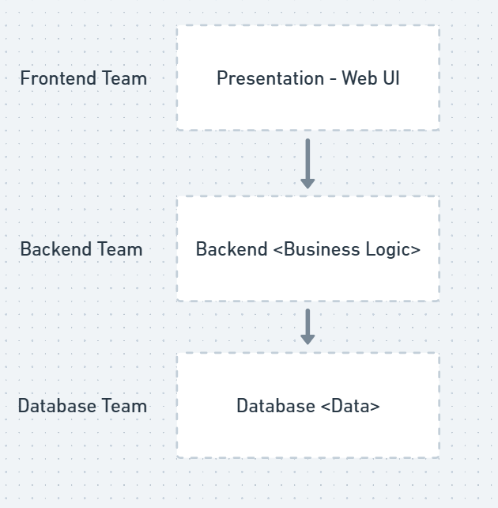

# What are Microservices ?

Microservices has become an increasing popular architecture choice
in the half decade.

This chapter help to look at the core ideas behind microservices,
the prior architecture that brought us here and reasons why this is so widely adopted.

## Microservices at a Glance

1. Microservices are independently releasable services that are modeled
   around a business domain.
2. A service encapsulates functionality and makes it accessible to other services
   via network - you can construct more complex system on this building block
3. Example one microservice represent inventory, another order processing and
   another shipping, but together they form a complete E-commerce system.
4. Microservices are an architecture choice that is focused on giving you many
   options for solving problems you might face.
5. On outside, microservices look like a black box and implements API's which
   can be used by other services or consumers.
6. Internal implementation of microservices is hidden from outside world. The
   language it uses and database it uses is hidden from outside world.
7. **Important** - This means microservice architecture avoid using shared database
   in most circumstances.
8. Microservices embrace the concept of **Information Hiding**. It means that it
   hides as much as information within the service and only exposes little
   information to outside world via external interfaces.
9. This allows you to change the internal implementation of microservice easily without
   affecting the outside world as the as the external interface remains the same.
10. Changes in microservice should affect upstream microservices, enabling
    independent releasability of functionality or s service.
11. Having clear, stable service boundaries that don't change when the internal implementation
    changes results in a system that have looser coupling and strong cohesion.

## Key Concepts of Microservices

Core ideas that must be understood when you explore microservices are

### Independent Deployability

1. Independent Deployability is the idea that when you make a change to a
   microservice, you can deploy that change without having to deploy any other
   microservices.
2. On surface, this seems like a simple idea, but it has a lot of implications.
3. Getting into a habit of deploying microservices independently will inherit
   bring a lot of discipline to your development process.
4. To ensure independent deployability, you need to ensure that the microservices
   are loosely coupled and have well defined interfaces.
5. Some implementation choice make this hard to achieve, such as using a
   shared database or tightly coupling the microservices.
6. To achieve independent deployability, there are so many things to get right
   that in turn brings own benefit
7. The desire for loosely coupled services with stable interfaces guides our
   thinking about how we find our microservice boundaries in the first place.

### Modeled Around Business Domain

1. Techniques like domain driven design help you to structure your code to better
   represent the real-world domain that software operates in.
2. With microservice we use same idea to define the service boundaries.
3. By modeling around business domain, we can make it easier to roll out new functionality
   and to recombine microservices in different ways to deliver new functionality
   to end users.
4. Rolling out new changes to more than one microservice is costly, it involves
   coordination with multiple services possibly multiple teams, you also need to
   manage the order in which it gets deployed.
5. The above takes more time than deploying to a single microservice.
   so keep multi-service changes infrequent as possible

6. A relatable example of three layered architecture that teams follow is split
   based on technology choice.
7. This architecture works well when you have the changes in the frontend or
   backend alone (particular layer). But often experience shows the change is
   often related to business needs and it often spread across all three layers.
8. But modelling the layer according to end to end slices of business functionality
   we ensure that our architecture is arranged to make changes to business
   functionality as efficient as possible.
9. With microservices we have made a decision to have strong cohesion based on
   business functionality and not on technical functionality.

**Three layer architecture based on technology**

### Owning their state

1. One of the things that people starting with microservice is not understanding
   the important of separate database per microservice

2. If a microservice wants to access data held by another microservice, it should
   ask the second microservices to get the data
3. This enforces clear interface best pratice which giving full control
   on what information to hide and what information to share via external interface
4. **Having shared database is a worst mistake in microservice** it will defeat
   the clear boundary isolation purpose & independent deployability
5. This separate database per microservice pushes us to define well defined
   external contract with back compatible fashion
6. By hiding the database per microservice we reduce coupling.

### Size

1. The size of the microservice should be kept as which it is easily understood.
2. Don't focus too much of the size.
3. As you are starting out think how many microservices
   you can manage.
4. As you have more services the complexity will increase and
   new need to learn new skills to adopt this standard.
5. Focus on strong cohesion based on business domain & have clear service
   boundaries remains a priority than worrying about the size.

### Flexibility

1. Microservices buy you options. They have a cost and you need to decide whether
   the cost is worth the options you want to take up
2. The microservice architecture gives flexibility in many axes - organizational,
   technical, scale, robustness
3. We don't know what the future holds so adopting microservices will give the flexibility
   to theoretically solve the problems we face down the line (But again it has cost)
   > Finding the balance between keeping your options open and bearing the architecture
   > is an real art
4. While you are increasing the flexibility with microservices, you are increasing
   the pain too. So take microservice pattern as incremental adoption
5. By incrementally adopting you have the flexibility to stop if required

### Alignment of Architecture & Organization

**Music corp** an e-commerce company sells CDs online, uses simple three layered
architecture. We like to add a feature to expose favorite genre of music.

1. It will cause change in all the layers, UI, Backend & Database.
2. The changes need to be coordinated between all teams to deploy.
3. This is fine, because traditionally this is how company operate, engineers are
   grouped based on core competency of technology skills
   
4. But today this approach got changed we need to build products faster so a
   team structure of poly skilled engineer owning end to end helps.
5. This forces us how we change our org structure the team.
6. Most of the changes we make to the system is based on business functionality
   & when such changes happens it mostly happens across all layers
7. In the earlier example the cohesion is made on the technology choice but
   when we think about our team structure as vertical slices instead of horizontal
   now the cohesion is made out of business domain
8. In this scenario if a team called **customer profile team** owns the end to
   end aspect the feature to add favorite genre is much localized change within
   that team
   
