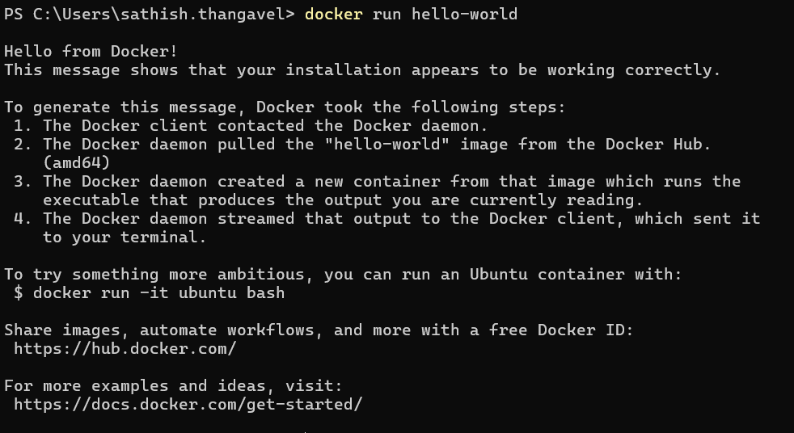
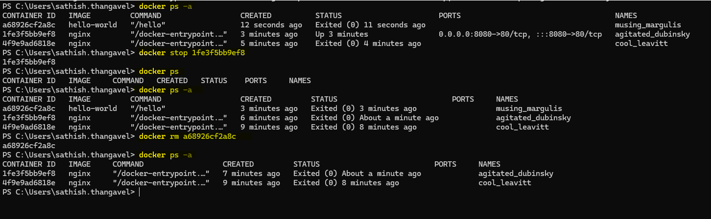
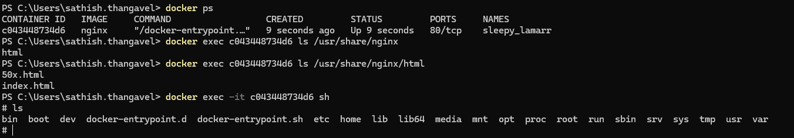
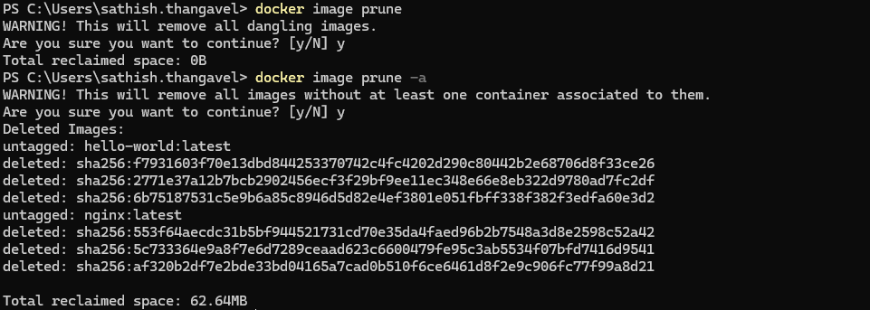

# Understanding Docker Container Engine

Let's explore Docker, the most popular containerization platform.

1. Docker is a most popular containerization platform.
2. It makes it easy to build,
   ship and run applications in isolated environments called containers.
3. It uses lightweight isolation (not full OS virtualization), making containers
   fast, portable, and efficient.
4. Docker popularized containers with
   1. Docker Engine
   2. Docker CLI
   3. Docker Hub (image registry)
   4. Docker Desktop


## 1. Installing Docker

The easiest and most beginner-friendly approach is using Docker Desktop.

:::tip
Download Docker Desktop from the [official site](https://www.docker.com/products/docker-desktop)
:::

It comes with:

1. Docker Engine
2. Docker CLI
3. Easy system UI
4. Automatic updates toggle & much more.

## 2. Logging in & verifying installation

After installation open your docker desktop app and sign in with your Docker Hub
account.

:::warning
Create a new Docker Hub account using your **personal email** if you don't have
one by following [this link](https://docs.docker.com/accounts/create-account/).
And post this workshop you can delete Docker Desktop
:::

## 3. Verify Docker is working

After docker desktop installation, a simple test command to run in your terminal

```sh
docker run hello-world
```

If everything is set up correctly, Docker

1. Pulls the hello-world image from docker hub
2. Runs a container
3. Prints a success message
4. This confirms your engine, networking and CLI all work.



## 4. Essential Docker Concepts

1. `Image` → Blueprint (template) for containers (like a class in OOP).
2. `Container` → Running instance of an image (like an object).
3. `Registry` → Storage for images (Docker Hub, ECR, ACR, GCR).
4. `Dockerfile` → Instructions to build your own image.
5. `Engine` → The runtime that actually runs your containers.

### Docker Image

A Docker image is a lightweight, standalone, executable package that contains
everything needed to run a piece of software like application code, runtime
,libraries, environment variables & configuration files

#### Layered Architecture

Docker images are built layer by layer, where each instruction
in a `Dockerfile` (such as `FROM`, `COPY`, `RUN`) creates a new layer.

1. Layers are stacked to form the final image.
2. They are cached, improving build speed.
3. If a layer doesn’t change, Docker reuses it in future builds.

#### Immutable

Once an image is built, it cannot be modified.

1. Any change creates a new layer or a new image version.
2. This immutability ensures consistency
   `If it runs on my machine, it will run everywhere.`

#### Portable

Images can run on any machine that has a compatible Docker engine.

1. You can develop on Windows, test on Linux, deploy on Kubernetes the same image.
2. This guarantees environment consistency.

### Docker Container

A Docker container is the runtime instance of a Docker image.

`If an image is a class, the container is an object`

#### Isolated

Containers run in their own isolated environment

1. Separate filesystem
2. Separate process space
3. Network namespace
4. Resource limits (CPU, memory)

#### Ephemeral

By default, containers are temporary, that means a container stops, its
filesystem changes are lost (unless using volumes).

## 5. Docker Command Cheat Sheet

Let's warmup with some essential Docker commands to run, manage images and containers.

### Images

```sh
docker pull  # Download an image
```

```sh
docker images # List all images
```

```sh
docker rmi  # Delete an image
```


### Run Containers

```sh
docker run  # Run a container in the foreground
```

```sh
docker run -p 8080:80  # Map host port → container port
```

```sh
docker run -d  # Run in detached mode (run in background)
```

```sh
docker run --name myapp  # Assign a name to your container
```


### Container Status

```sh
docker ps # Running containers
```

```sh
docker ps -a # All containers (including stopped)
```


### Stopping + Removing Containers

```sh
docker stop <id> # Stop a running container
```

```sh
docker rm <id> # Remove a stopped container
```



### Run a Command inside Container (Debugging purpose)

```sh
docker exec -it <id> sh # Open interactive shell inside container
```

```sh
docker exec -it <id> /bin/bash # Open interactive bash inside container
```

```sh
docker exec <id> ls /usr/share/nginx/html # print files in container
```



### Cleanup

```sh
docker container prune # Remove stopped containers
```


```sh
docker image prune # Remove unused dangling images
```

:::tip
A dangling image in Docker is an image that has no name, no tag
and is not used by any container. It is an unused leftover, usually
created after a build or update. Docker keeps them to save time during future builds.
:::

```sh
docker image prune -a # Remove all unused images
```



```sh
docker system prune # Remove unused data (do at risk!)
```

:::important

1. Docker system prune is a cleanup command that removes unused
   Docker data to free disk space.

2. It is safe, but you must understand what it deletes. It removes
   1. Dangling images
   2. Stopped containers,
   3. Unused networks (not default ones)
   4. Build cache

:::

:::tip

1. Explore more commands from the official [Docker CLI reference](https://docs.docker.com/reference/cli/docker/)
2. Cheat sheet - [Docker Cheat Sheet](https://dockerlabs.collabnix.com/docker/cheatsheet/)
3. Another best place to learn is from CLI itself - `docker <command> --help`

:::
