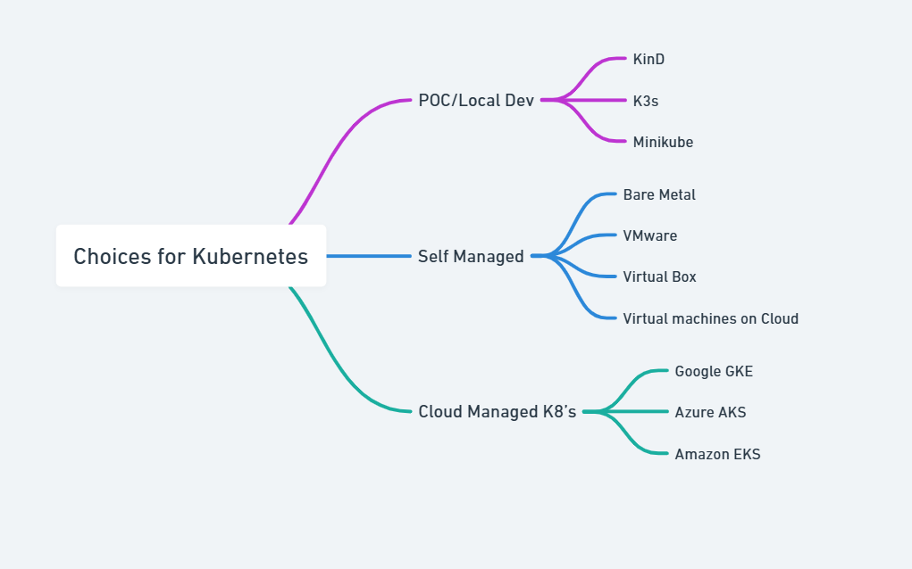

# Kubernetes Overview

Kubernetes (K8s) is an open-source container orchestration platform designed to automate
the deployment, scaling and management of containerized applications.

It was originally developed by Google and is now maintained by the Cloud Native
Computing Foundation (CNCF).

:::tip
Kubernetes is called k8's because there are 8 letters between the 'K' and the 'S'.
:::

## Installation Choices for K8's

There are multiple ways to install k8's depending on your use case



## Installation in Local Machine

1. Lets install minikube in your local machine for learning purpose.
2. Follow the [instructions here](https://minikube.sigs.k8s.io/docs/start/).
   Note use the powershell instructions for windows machine.
3. After installation run the below commands to start minikube

   ```sh
   minikube start --nodes 3
   ```

   

4. After that run `minikube status` to check the status of the cluster

   ```sh
   minikube status
   ```

   

5. Install kubectl command line tool by following [instructions here](https://kubernetes.io/docs/tasks/tools/install-kubectl-windows/).

   

6. Verify kubectl is working fine by running

   ```sh
   kubectl get nodes
   ```

   ```sh
   kubectl get pods -A
   ```

7. We will talk about `kubectl` commands in detail in later sections. Don't worry
   if you don't understand the output now.

## Basic Terminologies

1. Node: A node is a worker machine in Kubernetes, which can be a physical or
   virtual machine (1 node = 1 VM)
2. Pod: The smallest and simplest Kubernetes object. A pod represents a single
   instance of a running process in your cluster and can contain one or more containers.
   (Assume pod is wrapper over container for now)

## How to use Kubernetes?

1. Now that we have a running k8's cluster, we can deploy our containerized
   applications to it.
2. But how do we tell k8's what to deploy and how to deploy it?
3. There are two main ways:
   1. Imperative commands using `kubectl` (not recommended for production)
   2. Declarative configuration files (YAML/JSON) (recommended for production)
      
4. Lets see an example of `declarative configuration yaml file` to deploy a simple
   hello world pod.

```yaml
apiVersion: v1
kind: Pod
metadata:
  name: hello-world-pod
  labels:
    app: hello-world
    environment: demo
spec:
  containers:
    - name: hello-world-container
      image: hello-world
      ports:
        - containerPort: 80
```

## High level Architecture

s

```

```
