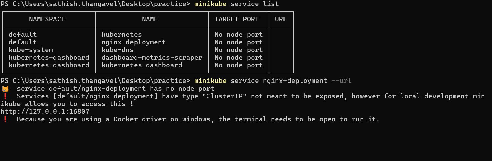

# Services

Let's start with a question, your pods are deployed & running

`But how do end users actually access your Pods and Deployments ?`

So far, we have learned

1. We deployed Pods
2. We deployed multiple Pods using Deployments
3. A Deployment ensures we always run N replicas of the same Pod (identical containers)
4. But when a user tries to access the application, they cannot directly talk to
   Pods
5. Pod IPs change frequently, Pods come and go & No guaranteed stability or discoverability

This is where Kubernetes `Services` come in.

## Why Services Are Needed ?

A Service acts as a stable entry point to communicate with a set of Pods.

### Without a Service

1. Pod IPs will change whenever a pod restarts & discoverability is difficult
2. Clients need to know pod IPs → bad practice

### With a Service

1. You get a stable, never-changing IP + DNS name
2. Traffic is load-balanced across pods
3. Only healthy pods receive traffic
4. `Kube-proxy` handles routing automatically
5. `Service` sits in front of the `Deployment`, and all user requests pass through
   it.


## How Traffic Routing Work

When users hit the Service

1. The Service selects pods based on `labels`
2. `kube-proxy` forwards the request to one of the pods
3. The selection is usually in `round-robin fashion` (can be configured differently)
4. Only healthy pods receive traffic
5. If one pod is down, the Service automatically stops routing traffic to it
6. This gives you built-in load balancing & self-healing routing.

## Types of Kubernetes Services

### 1. ClusterIP (default)

1. Accessible only inside the cluster
2. Good for microservices talking to each other
3. Not accessible from outside world

Example use cases:

1. Backend → Database
2. API → Cache
3. Frontend → Backend (inside cluster)

### 2. NodePort

1. Exposes a port on every node
2. Node’s IP + NodePort → reaches the Service
3. Useful for learning/debugging
4. Not ideal for production

Example:

```sh
http://<node-ip>:30080/
```

### 3. LoadBalancer

1. Cloud provider creates an external load balancer (Azure LB, AWS ELB, GCP LB)
2. Exposes a public endpoint
3. Traffic → Load balancer → Service → Pods
4. Ideal for production-grade public access

Example:

```sh
http://52.10.25.13 (external IP)
```


## Real world Example

Web application with frontend, backend & database


## Time to Practice

1.  First let's clean up the previous deployment

    ```sh
    kubectl delete deployment nginx-deployment
    ```

2.  Create a new deployment using the below yaml file `nginx-deployment.yaml`

    ```yaml
    apiVersion: apps/v1
    kind: Deployment
    metadata:
      name: nginx-deployment
      labels:
        app: nginx
    spec:
      replicas: 3
      selector:
        matchLabels:
          app: nginx
      template:
        metadata:
          labels:
            app: nginx
        spec:
          containers:
            - image: nginx
              name: nginx
              ports:
                - containerPort: 80
    ```

3.  Apply the deployment using the below command

    ```sh
     kubectl apply -f nginx-deployment.yaml
    ```

4.  Verify the deployment & pods are created and running using the below commands

    ```sh
     kubectl get deployments

     kubectl get pods -o wide
    ```

5.  Now create a `ClusterIP service` using the below `imperative command`

    ```sh
     kubectl expose deployment nginx-deployment --port=80
    ```

6.  Verify the service is created using the below command

    ```sh
     kubectl get services
    ```

7.  Now lets understand a bit more using describe command

    ```sh
     kubectl describe service nginx-deployment
    ```

8.  You can see the service created endpoints for all the pods in the nodes

    

9.  To debug whether the `service` created & working we can use minikube
    service command

    ```sh
     minikube service list
    ```

    ```sh
     minikube service nginx-deployment --url
    ```

    

10. Now lets create a `clusterIp` services using yaml file `nginx-service.yaml`

    ```yaml
    apiVersion: v1
    kind: Service
    metadata:
      name: nginx-cluster-ip
      labels:
        app: nginx
    spec:
      selector:
        app: nginx
      ports:
        - port: 80
          protocol: TCP
          targetPort: 80
      type: ClusterIP
    ```

11. Lets delete the previous service

    ```sh
     kubectl delete service nginx-deployment
    ```

12. Apply the service using the below command

    ```sh
     kubectl apply -f nginx-service.yaml
    ```

13. Verify the service is created using the below command

    ```sh
     kubectl get services
    ```

14. Now lets describe the service to see the details

    ```sh
     kubectl describe service nginx-cluster-ip
    ```

15. You can see the service created endpoints for all the pods in the nodes

16. Lets create a `NodePort` service using the below yaml file `nginx-node-port-service.yaml`

    ```yaml
    apiVersion: v1
    kind: Service
    metadata:
    name: nginx-node-port
    labels:
        app: nginx
    spec:
    selector:
        app: nginx
    ports:
        - port: 80
        protocol: TCP
        targetPort: 80
        nodePort: 30080
    type: NodePort
    ```

17. Delete all the previous service

    ```sh
     kubectl delete service nginx-cluster-ip
    ```

18. Apply the `NodePort` service using the below command

    ```sh
        kubectl apply -f nginx-node-port-service.yaml
    ```

19. Now we use the `minikube` service command to verify the service is working

    ```sh
        minikube service nginx-node-port
    ```

20. You should see the nginx welcome page in your browser

21. Unfortunately, we cannot create `LoadBalancer` service in minikube as it requires
    `cloud provider integration`. Let's see that in action when we deploy in
    cloud provider like `Azure`.

22. For completeness, here is the yaml for `LoadBalancer` service

    ```yaml
    apiVersion: v1
    kind: Service
    metadata:
      name: nginx-load-balancer
      labels:
        app: nginx
    spec:
      selector:
        app: nginx
      ports:
        - port: 80
          protocol: TCP
          targetPort: 80
      type: LoadBalancer
    ```

23. Lets delete the previous service

    ```sh
     kubectl delete service nginx-node-port
    ```

24. Apply the `LoadBalancer` service using the below command

    ```sh
     kubectl apply -f nginx-load-balancer-service.yaml
    ```

    

25. Since we are using minikube, the external IP will be in `pending` state as
    minikube does not support LoadBalancer service.
26. Recall the `cloud controller manager`
    from control plane architecture which is responsible for provisioning
    cloud resources like Load balancers etc.,

:::tip
You can use `kubectl get ep` for getting the endpoints created for the services
:::

## Labels and Selectors (Important!)

`Services` connect to `Pods` using `label selectors`.

Example:

```yaml
selector:
  app: myapp
```

1. Any Pod with `app: myapp` will automatically be part of the Service’s backend.
2. This allows Kubernetes to dynamically add/remove pods as Deployment scales up/down.

## Summary

1. Pods run your app
2. Deployments keep Pods running
3. Services provide a stable access point to your Pods
4. Services do load balancing + health-based routing
5. Service types solve different access needs
   1. ClusterIP → inside cluster
   2. NodePort → node-level port
   3. LoadBalancer → public access via cloud (k8s use cloud controller manager)
