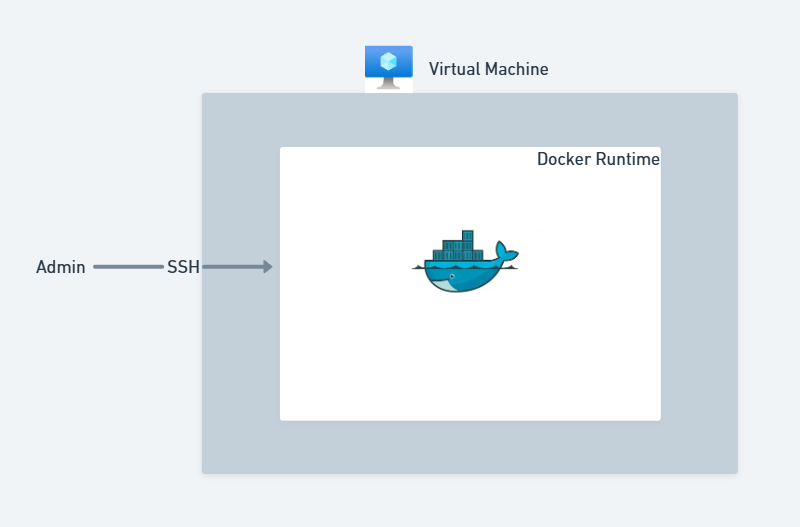
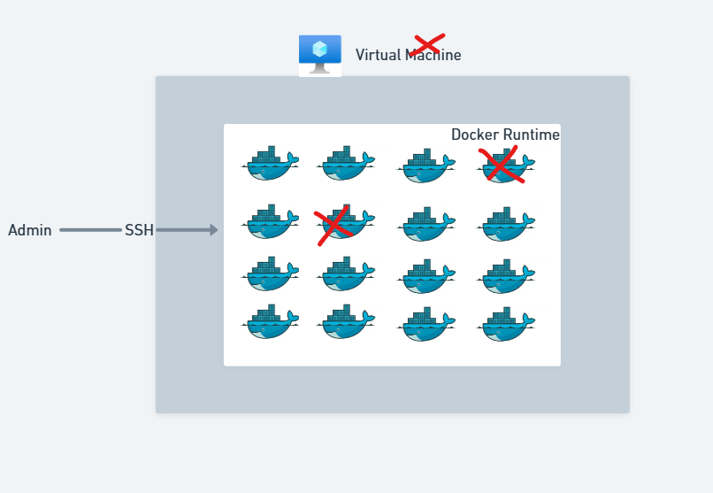

# Evolution of Deployment

Now that you have learned the basics of Docker, Dockerfile and Docker Compose,
it's time to see how everything fits together.

:::note
Your app can’t live on localhost forever. At some point, you’ve got to let your app
spread its wings, escape the `127.0.0.1` bubble and meet real humans who click
things they shouldn’t & raise bugs.
:::

When someone starts their container journey, everything begins simple.
You have an application. You package it in a container. You run it with Docker.
Life is good!

As the application grows, the needs grow too.
This is the natural evolution that any team go through.

## 1. The Beginning: single Container with Docker

Every team starts with a single container

```sh
docker build -t myapp .
docker run -p 3000:3000 myapp
```

This works perfectly for local development, simple applications & quick demos.



### Limitation appears

What if you have multiple services? A backend, frontend, database, Redis, message
queue etc., running with 10 docker run commands becomes unmanageable.

## 2. Growing Up: Multi-Container Apps with Docker Compose

The developer now organizes everything using a `docker-compose.yml`.

With just one command

```sh
docker compose up -d
```

1. They get multiple services, networking out-of-the-box, volumes for data,
   easy environment variable management

2. At this stage, many real-world projects stop here and there’s nothing wrong
   with that

3. If your app is small/medium & no SLA and it runs on a single machine,
   App Service, VM or EC2,Docker Compose is enough and it’s a perfect solution.


But then, the project grows again…


## 3. The Demand for Scaling: Enter Docker Swarm

The team now faces problems, they started getting complaints from
customers like app is not working & when they investigate,
they find issues like docker containers crashed & also VM Crashed.



1. They need high availability & they want failover when a container crashes
2. They want multiple VMs/nodes to cope with increased traffic & high availability

Docker Compose cannot do this. `Docker Swarm` comes to rescue.

### What Docker Swarm Gives You

1. Multi-node cluster (managers + workers)
2. Service scaling
3. Built-in load balancing
4. Secrets management etc.,

Example Swarm deployment

```sh
docker swarm init

docker stack deploy -c docker-compose.yml myapp
```

Swarm uses the same Docker Compose syntax, so the learning curve is low.

### Architecture of Docker Swarm


:::important
However, as systems become more complex having lot of microservices, distributed
systems, enterprise SLAs Docker Swarm eventually hits limits.
:::

## 4. The Final Evolution: Kubernetes

The organization now wants

1. Auto-scaling based on load
2. High availability
3. Self-healing infrastructure (failover mechanisms)
4. Advanced networking policies
5. Ingress controllers
6. Observability at scale
7. Canary deployments & blue-green releases
8. Much more..

This is where Kubernetes enters.

`Kubernetes is not a replacement for Docker or container runtimes,
it's an orchestration system that runs containers at massive scale.`

With Kubernetes, you get

1. Cluster-level scheduling
2. Horizontal Pod Autoscaling (HPA)
3. Node health checks & self-healing
4. Service discovery & load balancing
5. ConfigMaps & Secrets
6. Rollout's & rollbacks
7. Enterprise-grade extensions (Istio, Prometheus, ArgoCD, etc.)
8. And much more..

This is why nearly every enterprise company chooses Kubernetes for

1. Enterprise scale
2. High availability
3. Multi-region deployments
4. Cloud-native architectures

:::tip
Enterprise organization will typically run around thousands to millions of containers.
And Kubernetes is designed to handle this scale efficiently.
:::

## Final Takeaway

`There is no wrong choice.` You choose the tool based on your project’s needs.

1. If small project, one VM + few services → `Docker Compose`
2. If simple to medium project requiring multi-node → `Docker Swarm`
3. If large-scale, enterprise, microservices → `Kubernetes`

:::tip

1. Docker swarm is still catching up with features compared to Kubernetes.
2. At present, its a good middle ground for small to medium projects without
   Kubernetes complexity.

:::
