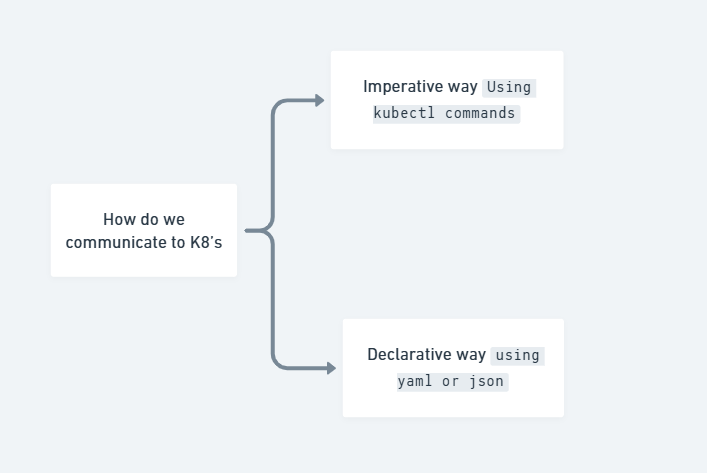

# Kubernetes Overview

Kubernetes (K8's) is an open-source container orchestration platform designed to
automate the deployment, scaling and management of containerized applications.

It was originally developed by `Google` and is now maintained by the `Cloud Native
Computing Foundation (CNCF)`.

:::tip[Fun Fact]
Kubernetes is called k8's because there are 8 letters between the 'K' and the 'S'.
:::

## Installation Choices for K8's

TO experience k8's, there are multiple ways to install k8's depending on your
use case


1. Local or dev purpose - minikube, kinD, k3s
2. If you need complete control over the data & cluster - Self managed k8's on
   VMs/ Bare metal
3. You don't need any operations overhead - Managed k8's services from cloud providers
   like AKS, EKS, GKE, OpenShift etc.,

## Installation in Local Machine

1. Lets install `minikube` in your local machine for learning purpose.
2. Follow the [instructions here](https://minikube.sigs.k8s.io/docs/start/).
   Note only use the `powershell instructions` for windows machine.
3. After installation run the below commands to start minikube, make sure your PC
   have at-least 10GB RAM and 8 CPU cores free.

4. If your are using **Docker Desktop** just run the below command to start minikube
   withe the following command

   ```sh
   minikube start --nodes 3
   ```

5. If you are using **Rancher Desktop**, run the below command

   ```sh
   minikube start --driver=docker --cpus=8 --memory=12000 --nodes=3 --container-runtime=containerd --network-plugin=cni
   ```

   

6. After that run `minikube status` to check the status of the cluster

   ```sh
   minikube status
   ```

   

7. Install kubectl command line tool by following [instructions here](https://kubernetes.io/docs/tasks/tools/install-kubectl-windows/).

   

8. Verify kubectl is working fine by running

   ```sh
   kubectl get nodes
   ```

   ```sh
   kubectl get pods -A
   ```

   

9. We will talk about `kubectl` commands in detail in later sections. Don't worry
   if you don't understand the output now.

:::tip
Sometimes `kubectl` command may not work directly with minikube. In case
you face issue use the below command to run kubectl commands with minikube context.

Run this in powershell `function kubectl { minikube kubectl -- @args }`
:::

## Basic Terminologies

1. **Node**: A node is a worker machine in Kubernetes, which can be a physical or
   virtual machine (1 node = 1 VM)
2. **Pod**: The smallest and simplest Kubernetes unit. A pod represents a single
   instance of a running process and can contain one or more containers.
   (Assume pod is wrapper over container for now)

## How to use Kubernetes?

1. Now that we have a running k8's cluster, we can deploy our containerized
   applications to it.
2. But how do we tell k8's what to deploy and how to deploy it?
3. There are two main ways:
   1. Imperative commands using `kubectl` (not recommended for production)
   2. Declarative configuration files (YAML/JSON) (recommended for production)
      

## Deploying the Pod to k8's

1. First lets look into the imperative way of deploying the pod using `kubectl`

   ```sh
   kubectl run --image=nginx nginx-pod
   ```

2. Now verify the pod is created and running using the below command

   ```sh
   kubectl get pods
   ```

   ```sh
    kubectl get pods -o wide
   ```

   

3. To see the logs of the pod run the below command

   ```sh
   kubectl logs nginx-pod
   ```

4. To see the logs in realtime use the `-f` flag or tail the logs

   ```sh
   kubectl logs -f nginx-pod
   ```

5. To see detailed information about the pod run the below command

   ```sh
   kubectl describe pod nginx-pod
   ```

6. Now that we have seen the imperative way of deploying a pod, lets see the
   declarative way using the above yaml file.

7. Save the below yaml file as `pod.yaml` and run the below command to
   create the pod

   ```yaml
   apiVersion: v1
   kind: Pod
   metadata:
   name: nginx-pod-1
   labels:
     env: demo
   spec:
   containers:
     - name: nginx-pod-1
       image: nginx:latest
   ```

   ```sh
   kubectl create -f pod.yaml
   ```

   

8. Verify the pod is created and running using the below command

   ```sh
   kubectl get pods
   ```

9. Typing the yaml file is time consuming. So we can leverage a shortcut, the dry
   run option to generate the yaml file from the imperative command.

   ```sh
    kubectl run nginx-3 --image=nginx --dry-run=client -o yaml > pod2.yaml
   ```

   

10. Now you can edit the `pod2.yaml` file to add more configurations if needed
    and create the pod using the below command

    ```sh
    kubectl create -f pod2.yaml
    ```

11. To edit an existing pod use the below command

    ```sh
    kubectl edit pod nginx-pod
    ```

12. You can also edit the `yaml` file and apply the changes using the below command

    ```sh
    kubectl apply -f pod.yaml
    ```

13. Similar to docker exec you can also exec into the pod using the below command

    ```sh
    kubectl exec -it nginx-pod -- sh
    ```

    ```sh
    minikube kubectl -- exec nginx-pod -it -- sh
    ```
