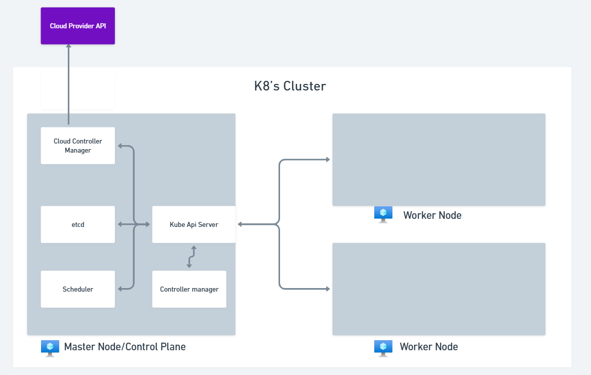

# k8's High level Architecture

Now that we have a basic understanding of k8's and have deployed our first pod,
let's look into the high level architecture of k8's

1. The main components of k8's architecture are

   1. **Master Node (Control Plane)** Can be multiple nodes for high availability
   2. **Worker Node** (Can be one or many nodes)
   3. **Cluster** is made up of multiple nodes (Master + Worker nodes)

   

2. The **Master Node** takes care of administration task and consists of the following
   components

   1. **API Server**: The front-end for the Kubernetes control plane. It exposes
      the Kubernetes API & is the entry point for all the REST commands used to
      control the cluster.
   2. **etcd**: A consistent and highly-available key value store used as Kubernetes
      backlog store for all cluster data.
   3. **Controller Manager**: Runs controller processes. A controller is a small
      program that watches the cluster and makes sure things are in the desired state
      (E.g node controller, pod controller etc.,)
   4. **Scheduler**: Watches for newly created Pods with no assigned node, and
      selects a node for them to run on.
   5. **Cloud Controller Manager**: Lets you link your cluster into your cloud
      provider's API and separates out the components that interact with that cloud
      platform from components that just interact with your cluster.

   

3. The **Worker Node** consists of the following components

   1. **Kubelet**: An agent that runs on each node in the cluster. It makes sure
      that containers are running in a Pod & kubelet communicates with the master
      node.
   2. **Kube-Proxy**: A network proxy that runs on each node in your cluster,
      it maintains network rules & handles routing of traffic to Pods from
      inside or outside the cluster.
   3. **Container Runtime (CRI)**: The software that is responsible for running
      containers (E.g containerd, docker etc.,). K8's supports multiple container
      runtimes through the Container Runtime Interface (CRI).
   4. **Pods**: The smallest and simplest Kubernetes object. A pod represents
      a single instance of a running process/application in your cluster and
      can contain one or more containers.

   
