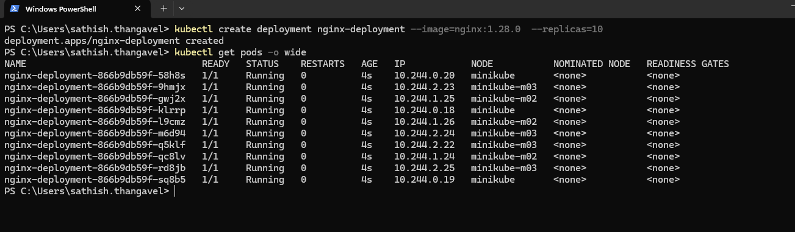
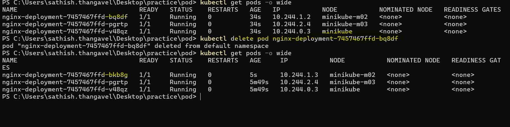
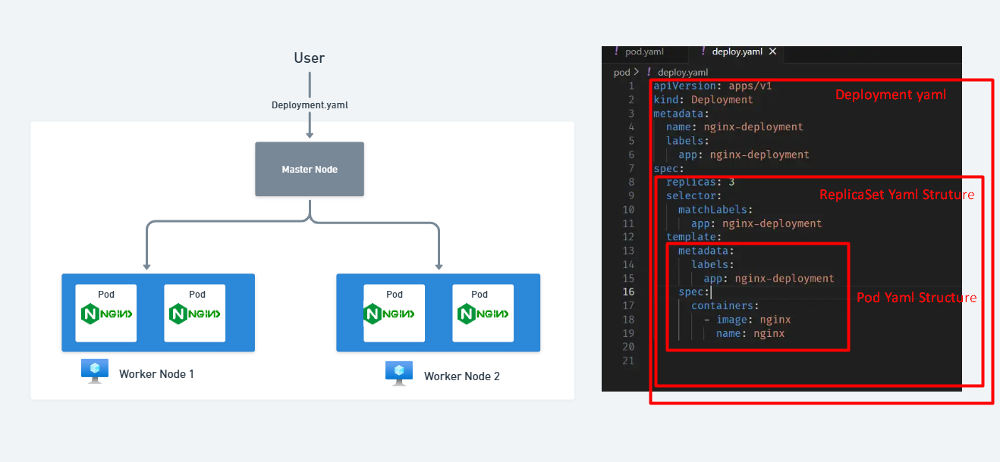

# Need for K8's Deployments

1. In the previous section we saw that pods are the smallest deployable units
   in k8's.
2. You created a pod using imperative command as well as declarative way using yaml.
3. But what happens if the pod goes down due to some reason?
4. Or what if you want to run multiple instances of the same pod for high
   availability? (For example, running 10 instances of nginx pod to handle more traffic)
5. In such scenarios, managing pods directly becomes complex & cumbersome.
6. To address these challenges, k8's provides higher level abstractions like
   `Deployments` on top of `pods`.

## K8's Deployments

Let's see what `Deployment` is and how it helps to manage pods.

1. A `Deployment` is a higher level abstraction over pods.
2. It ensures that a specified number of pod replicas are running at any given time.
3. If a pod goes down or crashed, the Deployment automatically creates a new pod
   to replace it, ensuring high availability.
4. Deployments also split pods across multiple nodes for fault tolerance.
5. You can also use Deployments to perform rolling updates to your application,
   allowing you to update your application without downtime.

## Exercise Deployment using Imperative Command

1. First let' clean up the previous pod

   ```sh
   kubectl delete pod nginx-pod-1
   ```

   or

   ```sh
   kubectl delete pod --all
   ```

2. Let's create a deployment using imperative command

   ```sh
   kubectl create deployment nginx-deployment --image=nginx:1.28.0  --replicas=10
   ```

3. Now verify the deployment and pods are created and running using the below commands

   ```sh
   kubectl get pods -o wide
   ```

   

4. Now lets delete one of the pods and see if deployment brings it back up
   to the desired state

   ```sh
   kubectl delete pod <your-pod-name>
   ```

5. Now verify the pods again using the below command & this proves that deployment
   controller is bringing back the desired state

   ```sh
   kubectl get pods -o wide
   ```

   

6. You can see the pods are spread across multiple nodes for fault tolerance.

   1. Note this depends on the number of nodes in your cluster.
   2. If you have only one node, all pods will be scheduled on the same node.
   3. Also if there are not enough resources (CPU or RAM) in the nodes, pods will
      be scheduled on the same node.
   4. In production, we don't deploy pods in control plane nodes for better performance
      and security.

7. Let' rollout an update to the deployment to use a different nginx version

   ```sh
   kubectl set image deployment/nginx-deployment nginx=nginx:1.29.0
   ```

8. Now let run this command & analyze the deployment details

   ```sh
   kubectl get deployments
   ```

   ```sh
   kubectl describe deployment nginx-deployment
   ```

9. Lets delete the pods we need to delete the deployment using the below command

   ```sh
   kubectl delete deployment nginx-deployment
   ```

## Exercise Deployment using YAML

1. Let's create a deployment using declarative way using the below command

   ```yaml
   apiVersion: apps/v1
   kind: Deployment
   metadata:
     name: nginx-deployment
     labels:
       app: nginx-deployment
   spec:
     replicas: 3
     selector:
       matchLabels:
         app: nginx-deployment
     template:
       metadata:
         labels:
           app: nginx-deployment
       spec:
         containers:
           - image: nginx
             name: nginx
   ```

2. The `selector` field in Deployment helps to identify the pods that belong
   to the Deployment. So the matching happens based on `labels`.

   

3. Save the above yaml file as `deploy.yaml` & run the below command to create the deployment

   ```sh
    kubectl apply -f deploy.yaml
   ```

4. Now lets reduce the replicas to 2 in the `deploy.yaml` file, you can edit
   the `deploy.yaml` file `replicas` field as 2 replicas.

5. Now let's apply the deployment using the below command

   ```sh
    kubectl apply -f deploy.yaml
   ```

6. Now verify the deployment and pods are created and running using the below commands

   ```sh
    kubectl get pods -o wide
   ```

:::tip

1. You can also use this shortcut to create `deployment.yaml` using imperative command
   and generate yaml file directly. Note that this command only generates the
   yaml file, it doesn't apply the deployment to the cluster.

   ```sh
   kubectl create deployment nginx-deployment --image=nginx  --replicas=3
    --dry-run=client -o yaml > deploy.yaml
   ```

:::

:::tip[production tip]

1. In Production, we don't deploy using imperative commands. We use declarative
   way using yaml files or using tools like [Helm Charts](https://helm.sh/)
2. This helps to manage the infrastructure as code and version control. Also it
   helps to automate the deployment process using CI/CD pipelines.
3. Also, we don't directly deploy `pods` in production, instead we use higher
   level abstractions like `Deployments` etc.,

:::

## K8's Namespace

1. Lets say now our organization has multiple teams working on different projects.
2. All of them are using the same k8's cluster for their deployments.
3. How do we manage the resources and deployments for different teams/projects?
4. This is where `Namespaces` come into play.
5. As of now, we ave been using the `default` namespace for all our deployments.
6. A `Namespace` is a way to divide cluster resources between multiple users
   (teams/projects).
7. Namespaces are like multiple teams within the same organization.
8. Namespaces provide a isolated scope. You can use namespaces to separate environments
   between the different teams within the same cluster.

9. You can see all the existing namespaces in the cluster using the below command:

   ```sh
   kubectl get namespaces
   ```

   

10. You can create a namespace using the below command:

    ```sh
    kubectl create namespace project-stellar-dev
    ```

11. Let's create a deployment in the newly created namespace using the below command:

    ```sh
    kubectl create deployment nginx-deployment --image=nginx --replicas=2 -n project-stellar-dev
    ```

12. Now verify the deployment and pods are created and running in the
    `project-stellar-dev` namespace using the below commands:

    ```sh
    kubectl get pods -n project-stellar-dev -o wide
    ```

    

13. For this workshop, we can use the `default` namespace. But in production,
    it's a good practice to create separate namespaces for different teams
    or projects.

:::tip[Production tip]

1. We don't deploy directly to `default` namespace, instead we create separate namespaces
   for different teams or projects.

:::

## Summary

1. A Deployment is a higher level abstraction that manages a set of identical pods.
2. It ensures high availability by automatically replacing crashed pods
   and splitting pods across multiple nodes.
3. Deployments also support rolling updates and rollback capabilities.
4. A `Namespace` is a way to divide cluster resources between multiple users
   (teams/projects).
