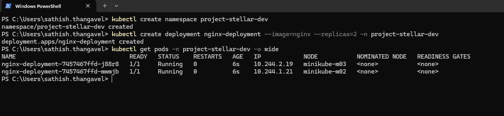

# Need for K8's Namespace

1. Lets say now our organization has multiple teams working on different projects.
2. All of them are using the same k8's cluster for their deployments.
3. How do we manage the resources and deployments for different teams/projects?
4. This is where `Namespaces` come into play.

## Understanding K8's Namespaces

1. As of now, we ave been using the `default` namespace for all our deployments.
2. A `Namespace` is a way to divide cluster resources between multiple users
   (teams/projects).
3. Namespaces provide a isolated scope. You can use namespaces to separate environments
   between the different teams within the same cluster.
4. You can see all the existing namespaces in the cluster using the below command:

   ```sh
   kubectl get namespaces
   ```

   

5. You can create a namespace using the below command:

   ```sh
   kubectl create namespace project-stellar-dev
   ```

6. Let's create a deployment in the newly created namespace using the below command:

   ```sh
   kubectl create deployment nginx-deployment --image=nginx --replicas=2 -n project-stellar-dev
   ```

7. Now verify the deployment and pods are created and running in the
   `project-stellar-dev` namespace using the below commands:

   ```sh
   kubectl get pods -n project-stellar-dev -o wide
   ```

   

8. For this workshop, we can use the `default` namespace. But in production,
   it's a good practice to create separate namespaces for different teams
   or projects.

:::tip[Production tip]

1. We should not deploy directly to `default` namespace, instead we must
   create separate namespaces for different teams or projects.

:::
