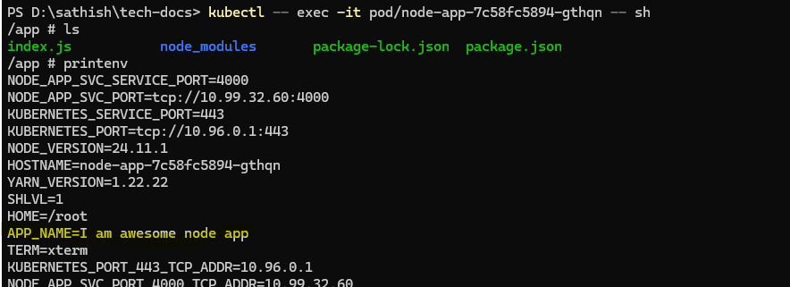

# K8's Env

:::warning[Request]

1. We will cover the first 4 topics in this section. Before pausing for a QA break.
2. Feel free to ask any blocking questions .
3. The fourth topics will have a practice session, which involves some waiting time
   for the changes to reflect in minikube.
4. So, it's better to pause there for questions for a while and continue after
   the break.

:::

1. In any application, we have certain configuration values that are required for
   the application to run.
2. These configuration values are generally passed as environment variables.
3. In K8's, we can pass environment variables to our pods using the `env` field
   in the pod specification.
4. In the case of `deployment` we can pass environment variables in the same way
   as we do in pods.

   ```yaml
   apiVersion: apps/v1
   kind: Deployment
   metadata:
     name: backend
     labels:
       app: backend
   spec:
     replicas: 3
     selector:
       matchLabels:
         app: backend
     template:
       metadata:
         labels:
           app: backend
       spec:
         containers:
           - image: sathish1996/node-app:1.0.0
             imagePullPolicy: Always
             name: backend
             ports:
               - containerPort: 4000
             env:
               - name: APP_NAME
                 value: "I am awesome node app"
               - name: LOG_LEVEL
                 value: "DEBUG"
   ```

## Practice Time - Env Variables

1. You can edit the python app or node js app from previous practice to read the
   environment variable `APP_NAME` and return it in the response.

   ```js
   app.get("/", (req, res) => {
     const env = {
       APP_NAME: process.env.APP_NAME,
       LOG_LEVEL: process.env.LOG_LEVEL,
     };

     res.json({
       message: "Environment Variables",
       env: env,
     });
   });
   ```

2. Rebuild the docker image and push it to docker hub.
3. Update the deployment yaml file to include the env variable as shown above.
4. Cleanup the existing deployment using the below command

   ```sh
   kubectl delete deployment --all
   ```

5. Apply the new deployment using the below command

   ```sh
   kubectl apply -f deployment.yaml
   ```

6. Verify the pods are recreated using the below command

   ```sh
   kubectl get pods
   ```

7. Access the application using the service & minikube service URL & verify the
   response contains the environment variable value.

8. **Tip**: To debug the environment variables in the pod, you can exec into the
   pod and run the `printenv` command.

   ```sh
    kubectl exec -it <pod-name> -- sh
    printenv
   ```

   ```sh
    minikube kubectl -- exec -it <pod-name> -- sh
    printenv
   ```


