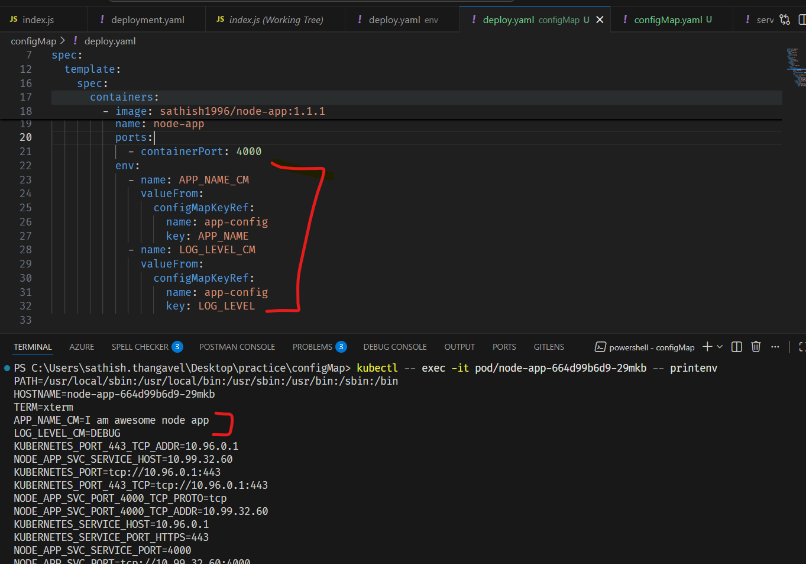
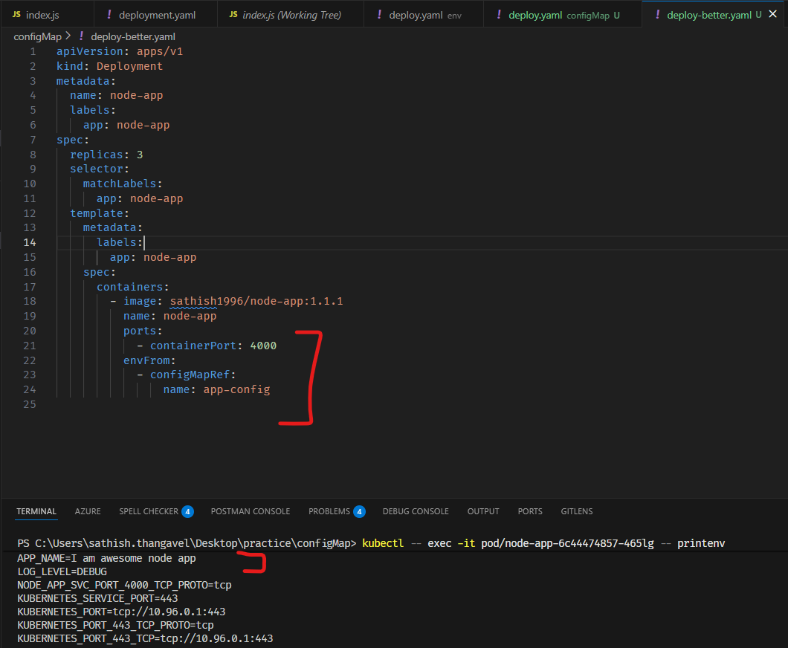

# K8's Config Maps

1. K8's Env are good but what if we have large number of configuration values
   or you need to share across multiple `deployment yamls`?
2. In K8's, ConfigMaps are used to store non-confidential configuration data in
   key-value pairs.
3. ConfigMaps allow you to decouple configuration artifacts from image content
   to keep containerized applications portable.
4. ConfigMaps can be shared across multiple pods and can be updated
   independently of the pod lifecycle.
5. ConfigMaps can be created using yaml files.

   ```yaml
   apiVersion: v1
   kind: ConfigMap
   metadata:
     name: app-config
   data:
     APP_NAME: "I am awesome node app"
     LOG_LEVEL: "DEBUG"
   ```

6. ConfigMaps can be consumed in pods as environment variables or as
   configuration files in volumes.

   ```yaml
   apiVersion: apps/v1
   kind: Deployment
   metadata:
     name: node-app
     labels:
       app: node-app
   spec:
     replicas: 3
     selector:
       matchLabels:
         app: node-app
     template:
       metadata:
         labels:
           app: node-app
       spec:
         containers:
           - image: sathish1996/node-app:1.1.1
             imagePullPolicy: Always
             name: node-app
             ports:
               - containerPort: 4000
             env:
               - name: APP_NAME_CM
                 valueFrom:
                   configMapKeyRef:
                     name: app-config
                     key: APP_NAME
               - name: LOG_LEVEL_CM
                 valueFrom:
                   configMapKeyRef:
                     name: app-config
                     key: LOG_LEVEL
   ```

7. Now deploy the configmap using the below command

   ```sh
    kubectl apply -f configmap.yaml
   ```

8. Now update the deployment yaml to use configmap as shown above & apply the deployment using the below command

   ```sh
    kubectl apply -f deployment.yaml
   ```

9. Verify the pods are recreated using the below command

   ```sh
   kubectl get pods
   ```

10. Access the application using the service & minikube service URL & verify the
    response contains the configmap values.

11. **Tip**: To debug the environment variables in the pod, you can exec into
    the pod and run the `printenv` command.

    ```sh
    kubectl exec -it <pod-name> -- sh
    printenv
    ```

    ```sh
    minikube kubectl -- exec -it <pod-name> -- sh
    printenv
    ```

    

## Better way to manage configmaps

1. Instead of passing each key value pair in the configmap yaml, you can
   pass a whole key values using the below command

   ```yaml
   apiVersion: apps/v1
   kind: Deployment
   metadata:
     name: node-app
     labels:
       app: node-app
   spec:
     replicas: 3
     selector:
       matchLabels:
         app: node-app
     template:
       metadata:
         labels:
           app: node-app
       spec:
         containers:
           - image: sathish1996/node-app:1.0.0
             imagePullPolicy: Always
             name: node-app
             ports:
               - containerPort: 4000
             envFrom:
               - configMapRef:
                   name: app-config
   ```

2. This will pass all the key value pairs from the configmap as environment variables to the pod.
3. Apply the deployment using the below command

   ```sh
    kubectl apply -f deployment.yaml
   ```

4. Verify the pods are recreated using the below command

   ```sh
    kubectl get pods
   ```

5. Access the application using the service & minikube service URL & verify the response contains the configmap values.

6. **Tip**: To debug the environment variables in the pod, you can exec into the pod and run the `printenv` command.

   ```sh
    kubectl exec -it <pod-name> -- sh

    printenv
   ```

   ```sh
    minikube kubectl -- exec -it <pod-name> -- sh

    printenv
   ```

7. **Tip**: Create a minikube service url by this command to access the application

   ```sh
    minikube service <service-name>
   ```



