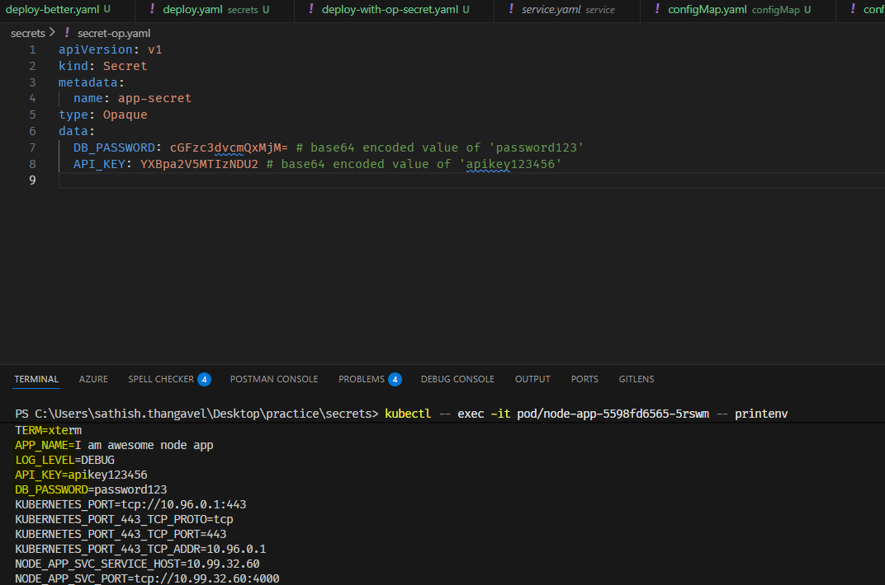

# K8's Secrets

1. In K8's, Secrets are used to store sensitive information such as passwords, OAuth tokens, and ssh keys.
2. Secrets are similar to ConfigMaps but are specifically designed to hold confidential data.
3. Secrets are stored in an encoded format (base64) to provide a basic level of security.
4. We have multiple types of secrets like Opaque, Docker Registry, TLS, basic, ssh, k8's token etc.
5. **Important**: While Secrets provide a basic level of security by encoding the data, they are not encrypted by default.

:::important
    1. With native K8's **secrets are not encrypted by default**.
    2. For enhanced security, consider using additional encryption mechanisms or tools like K8's Encryption at Rest or  external secret management solutions.
    2. Always follow best practices for managing sensitive data in your applications.
    3. In real projects, we store secrets in external secret management tools like HashiCorp Vault, AWS Secrets Manager, Azure Key Vault, Github Secrets, etc., and inject them into K8's at runtime.
    4. Managed K8's services like GKE, EKS, AKS provide integration with their respective secret management services for better security.
:::

## Lets see an example

1. Till now we pulled the docker images from public docker hub repos. But in real time scenarios, we may have private docker repos to store our docker images.

2. Lets first create a private repo in docker hub & push a sample private docker image. Go to docker hub & create a new private repo.

3. You can push the backend service image from earlier section practice to the private repo.

 
 

## Let's create a new deployment

1. Let's clean up all the existing deployments & services from previous practice.

    ```sh
    kubectl delete deployment <name-of-deployment>
    kubectl delete service <name-of-service>
    ```

2. Now lets replace the deployment image with the private image from docker hub.

    ```yaml
    apiVersion: apps/v1
    kind: Deployment
    metadata:
        name: node-app
        labels:
            app: node-app
    spec:
        replicas: 3
        selector:
            matchLabels:
                app: node-app
        template:
            metadata:
            labels:
                app: node-app
            spec:
            containers:
                - image: sathish1996/private-repo:1.1.1
                name: node-app
                ports:
                    - containerPort: 4000
                envFrom:
                    - configMapRef:
                        name: app-config
    ```

3. Apply the deployment using the below command

   ```sh
    kubectl apply -f deployment.yaml
   ```

4. You will notice the pods will be in `ErrorImagePull` state because K8's is not able to pull the private image without authentication.

    ```sh
     kubectl get pods
    ```

5. Analyse the error using the below command

    ```sh
     kubectl describe pod <pod-name>
    ```

6. To fix this issue, we need to create a secret with docker registry credentials and link it to the deployment.

7. Lets go to docker hub and create a PAT (Personal Access Token) for authentication.
    

8. Create a docker secret using the below command

    ```sh
     kubectl create secret docker-registry my-private-secret --docker-email=your@gmail.com --docker-username=your-username --docker-password=your-docker-pat --docker-server=https://index.docker.io/v2/
    ```

    
9. Verify the secret is created using the below command

    ```sh
     kubectl get secrets
    ```

10. Now update the deployment yaml to include the imagePullSecrets section as shown below
    

11. Redeploy the deployment using the below command

   ```sh
    kubectl apply -f deployment.yaml
   ```

12. Verify the pods are created and running using the below command

   ```sh
    kubectl get pods
   ```

13. Access the application using the service & minikube service URL & verify the app is working fine in browser.

## Create a Opaque secret

1. Opaque type Secrets can be created using yaml files.

    ```yaml
        apiVersion: v1
        kind: Secret
        metadata:
            name: app-secret
        type: Opaque
        data:
            DB_PASSWORD: cGFzc3dvcmQxMjM=  # base64 encoded value of 'password123'
            API_KEY: YXBpa2V5MTIzNDU2  # base64 encoded value of 'apikey123456'
    ```

2. Apply the secret using the below command

   ```sh
    kubectl apply -f secret.yaml
   ```

3. Verify whether the secret is created using the below command

   ```sh
    kubectl get secrets
   ```
4. Now update the deployment yaml to use the secret as shown below

    ```yaml
    apiVersion: apps/v1
    kind: Deployment
    metadata:
        name: node-app
        labels:
            app: node-app
    spec:
        replicas: 3
        selector:
            matchLabels:
                app: node-app
        template:
            metadata:
            labels:
                app: node-app
            spec:
            containers:
                - image: sathish1996/private-repo:1.1.1
                name: node-app
                ports:
                    - containerPort: 4000
                envFrom:
                    - configMapRef:
                        name: app-config
                    - secretRef:
                        name: app-secret
    ```
5. This will pass all the key value pairs from the secret as environment variables to the pod.
6. Apply the deployment using the below command

   ```sh
    kubectl apply -f deployment.yaml
   ```
7. Verify the pods are recreated using the below command

   ```sh
    kubectl get pods
   ```
8. Use the below command to exec into the pod and verify the secret values are available as environment variables

   ```sh
    kubectl exec -it <pod-name> -- sh

    printenv
   ```

   ```sh
    minikube kubectl -- exec -it <pod-name> -- sh

    printenv
   ```

