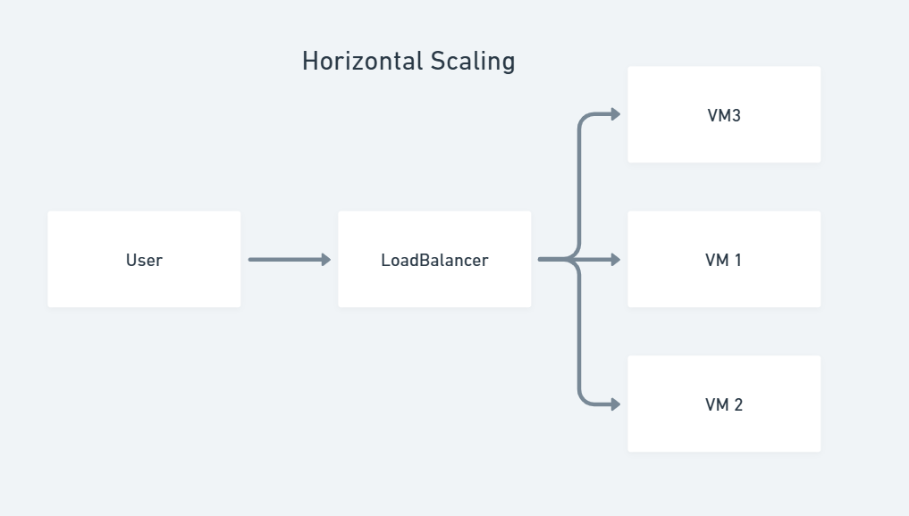
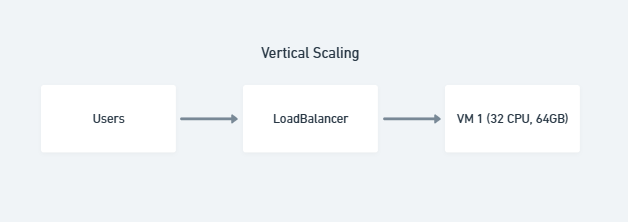
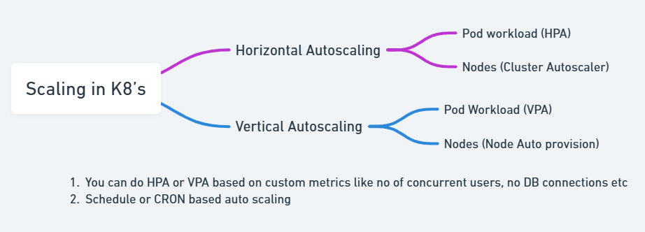
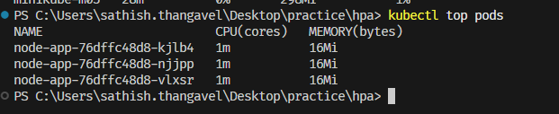
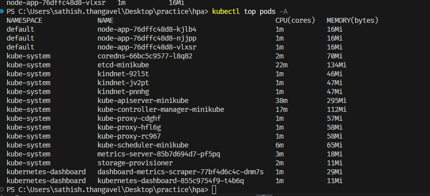
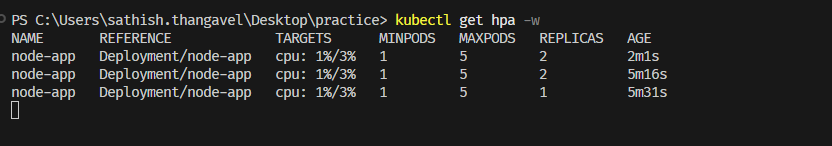
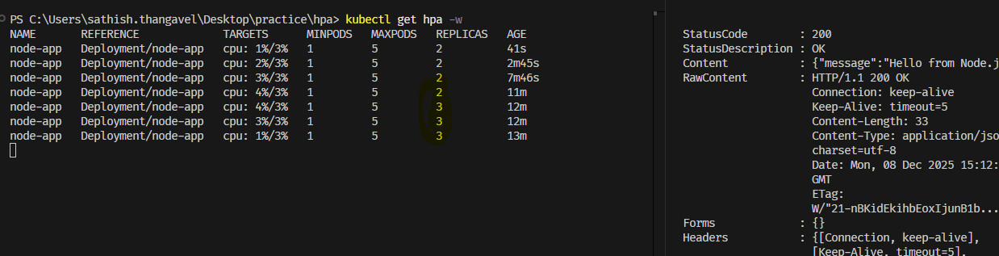

# Understanding Resource Requests & Limits

1. Let's imagine you have a pod running in a K8's
2. Every pod will consume a certain amount of CPU and memory resources from the
   node it is scheduled on.
3. Let's say your pod is consuming 1 CPU and 256MB memory.And there is a memory
   leak in your application which is causing the pod to consume more memory
   over time.
4. What will happen when the pod exceeds the available memory on the node?
5. The pod will be terminated by the K8's scheduler and will be restarted again &
   also node resources will be affected.
6. To prevent this from happening, we can set `resource requests` and
   `resource limits` for the pod.
7. `Resource Requests` specify the minimum amount of CPU and memory resources
   that a pod needs to run.
8. `Resource Limits` specify the maximum amount of CPU and memory resources
   that a pod can use.
9. By setting resource requests and limits, we can ensure that the pod has
   enough resources to run without being terminated due to resource exhaustion.

:::tip

1. When memory limit is reached, the pod will be terminated with
   an "Out of Memory" (OOM) error.
2. When CPU limit is reached, the pod will be throttled, meaning
   it will be allowed to use only a certain percentage of CPU time.
   And you will see a drop in performance.
3. Kubernetes does this to ensure that no single pod can monopolize the
   resources of a node, which could lead to resource starvation for
   other pods running on the same node.

:::

## Example of Pod with Resource Requests & Limits

1. Let's see in action about the OOM error when memory limit is reached.
2. You can use the below yaml file to create a pod with resource requests and limits.

   ```yaml
   apiVersion: v1
   kind: Pod
   metadata:
     name: stress-test
   spec:
     containers:
       - name: stress-test
         image: polinux/stress
         command: ["stress"]
         args: ["--vm", "1", "--vm-bytes", "128M", "--timeout", "30s"]
         resources:
           requests:
             cpu: "1"
             memory: "50Mi"
           limits:
             cpu: "1"
             memory: "110Mi"
   ```

## Need for Scaling in K8's

1. In a production environment, the load on an application can vary
   significantly over time.
2. During peak hours, the application may experience a surge in traffic,
   leading to increased resource consumption.
3. During off-peak hours, the load may decrease, resulting in underutilized
   resources.
4. Scaling helps to adjust the resources allocated to an application based on
   the current load, ensuring optimal performance and cost-efficiency.

## Understanding Horizontal & Vertical Scaling

1. In general, there are two types of scaling - **Horizontal Scaling** and
   **Vertical Scaling**.
2. Horizontal Scaling (Scaling Out/In) involves adding or removing instances,
   such as adding more servers to a cluster to handle increased load.
3. Vertical Scaling (Scaling up/down) involves adding or removing resources to
   an existing instance, such as increasing the CPU or memory of a server
   to improve its performance.
4. If this process is automated based on predefined conditions, it is referred
   to as Auto-scaling. if it is done manually, it is called Manual Scaling.




## K8's HPA & VPA

1. K8's has built-in support for horizontal scaling through the Horizontal Pod
   Autoscaler (HPA) resource.
2. HPA automatically adjusts the number of pod replicas in a deployment based on
   observed CPU utilization or other select metrics.
3. HPA continuously monitors the resource usage of pods and scales the number of
   replicas up or down to maintain the desired performance levels.
4. Vertical Scaling in K8's is achieved through the Vertical Pod Autoscaler (VPA)
   resource.
5. VPA automatically adjusts the resource requests and limits of pods based on
   observed resource usage.
6. VPA continuously monitors the resource usage of pods and adjusts the resource
   requests and limits to optimize performance.
7. Both HPA and VPA can be configured using yaml files or imperative commands.



## How K8's collects metrics to start HPA & VPA?

1. K8's uses the Metrics Server to collect resource usage metrics from nodes and
   pods in the cluster.
2. Kubelet on each node collects resource usage data and exposes it through the
   Kubelet API.
3. The Metrics Server periodically scrapes the Kubelet API to gather resource
   usage metrics.
4. The collected metrics are then made available to the HPA and VPA controllers
   in the control plane for scaling decisions.
5. Metrics Server needs to be deployed in the cluster for HPA and VPA to function
   properly.


## Let's see HPA in action

1. You can use the below yaml file to create a deployment with HPA enabled.

   ```yaml
   apiVersion: apps/v1
   kind: Deployment
   metadata:
     name: backend
     labels:
       app: backend
   spec:
     replicas: 2
     selector:
       matchLabels:
         app: backend
     template:
       metadata:
         labels:
           app: backend
       spec:
         containers:
           - image: sathish1996/node-app:1.0.0
             imagePullPolicy: Always
             name: backend
             ports:
               - containerPort: 4000
             resources:
               requests:
                 cpu: "100m"
                 memory: "256Mi"
               limits:
                 cpu: "200m"
                 memory: "512Mi"
   ```

2. Enable metrics server in te minikube cluster using below command:

   ```bash
   minikube addons enable metrics-server
   ```

   

3. Wait for sometime for the metrics server to start,
   then verify the metrics server is running using below command:

   ```bash
   kubectl get deployment metrics-server -n kube-system
   ```

   

4. We can also see the resource usage of nodes using below command:

   ```bash
   kubectl top nodes
   ```

   

5. As we enabled the metrics server, we can now see the resource usage of pods
   using below command:

   ```bash
   kubectl top pods
   ```

   
   

6. Let's port forward the deployment using below command & verify in browser

   ```bash
   kubectl port-forward deployment/backend 5001:4000
   ```

7. Now, we can create HPA for the deployment using below command:

   ```bash
    kubectl autoscale deployment backend --min=1 --max=5 --cpu-percent=3
   ```

   

8. You can notice the deployment replicas is set to 2 initially. But as we have
   set the HPA with min as 1 and max as 5, the hpa will be re-adjusted to 1
   pod. This will take some time to reflect in minikube

   
   

9. We can now generate some load on the deployment using `curl` tool in your `powershell`.

   ```sh
   while ($true) {
      curl http://localhost:5001
   }
   ```

10. As we generate load on the deployment, we can see the HPA is scaling the
    deployment replicas based on the CPU utilization.

    ```sh
    kubectl get hpa -w
    ```

    

11. You can notice the replicas are increased to handle the load.

    ```sh
    kubectl get pods
    ```

    

12. Stop the load, the HPA will scale down the replicas to the minimum
    value set.

    ```sh
    kubectl get hpa -w
    ```

13. Congratulations! You have successfully implemented HPA in K8's.

## Summary

1. By now you must have understood the importance of resource requests
   and limits in K8's.
2. You have also learned about Horizontal and Vertical scaling in K8's.
3. You have also seen HPA in action by creating a deployment with HPA enabled.
