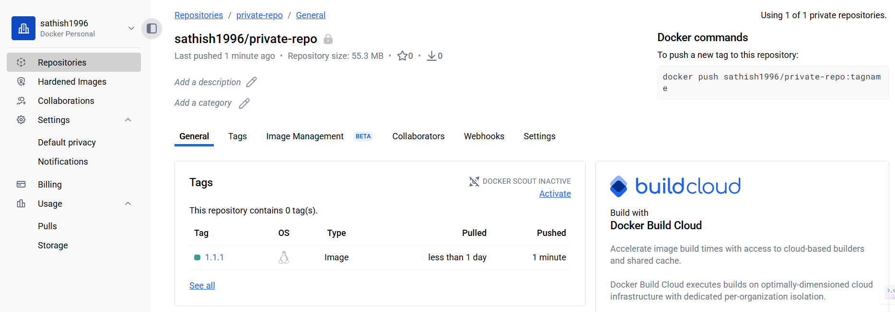

# K8's - Additional Concepts

## K8's Probes - Liveness and Readiness

1. Imagine you have a web application running in a Kubernetes pod.
2. Over time, the application might encounter issues like deadlocks or
   stuck in while loop (just for fun) causing it to become unresponsive.
3. How does Kubernetes know when your application is healthy or ready to serve traffic?
4. This is where **Liveness Probes** and **Readiness Probes** come
   into play.
5. **Liveness Probe** checks if your application is alive. If it fails,
   Kubernetes will restart the pod.
6. **Readiness Probe** checks if your application is ready to serve traffic.
   If it fails, Kubernetes will stop sending traffic to the pod until it passes again.
7. You can configure these probes using HTTP requests, TCP sockets, or command execution.
8. Here's an example of how to define liveness and readiness probes in a Kubernetes
   deployment YAML:

   ```yaml
   apiVersion: apps/v1
   kind: Deployment
   metadata:
     name: nginx-deployment
     labels:
       app: nginx
   spec:
     replicas: 2
     selector:
       matchLabels:
         app: nginx
     template:
       metadata:
         labels:
           app: nginx
       spec:
         containers:
           - name: nginx
             image: nginx:1.25
             ports:
               - containerPort: 80
             readinessProbe:
               httpGet:
                 path: /
                 port: 80
               initialDelaySeconds: 5 # Wait 5s before starting checks
               periodSeconds: 5 # Check every 5s
               failureThreshold: 3 # After 3 failures → pod marked Unready
               timeoutSeconds: 2 # Timeout for each check
             livenessProbe:
               httpGet:
                 path: /
                 port: 80
               initialDelaySeconds: 10 # Wait 10s before checking liveness
               periodSeconds: 10 # Check every 10s
               failureThreshold: 3 # After 3 failed checks → pod restarted
               timeoutSeconds: 2 # Timeout for each check
   ```

9. You can deploy this YAML using

   ```sh
    kubectl apply -f <filename>.yaml.
   ```

10. Observe the log output to understand how probes checks periodically.

    ```sh
    kubectl logs -f <pod-name>
    ```

## k8's StatefulSets - Managing State in K8's

1. In Kubernetes, most workloads are stateless, meaning they don't retain any
   data between restarts.
2. We use `Deployments` for such stateless applications.
3. However, some applications require `persistent storage and stable network identities`.
4. Examples include databases like MySQL, PostgreSQL, and
   distributed systems like Kafka.
5. This is where **StatefulSets** come into play.
6. A StatefulSet is a Kubernetes resource that manages the deployment and scaling
   of stateful applications.
7. It provides guarantees about the ordering and uniqueness of pods.
8. Key features of StatefulSets:
   - Stable, unique network identifiers for each pod.
   - Stable, persistent storage using PersistentVolumeClaims (PVCs).
   - Ordered, graceful deployment and scaling of pods.
   - Ordered, automated rolling updates.
9. Here's an example of a StatefulSet definition for a simple MySQL database:

   ```yaml
   apiVersion: apps/v1
   kind: StatefulSet
   metadata:
     name: mysql
   spec:
     serviceName: "mysql"
     replicas: 3
     selector:
       matchLabels:
         app: mysql
     template:
       metadata:
         labels:
           app: mysql
       spec:
         containers:
           - name: mysql
             image: mysql:5.7
   ```

## K8's Job & CronJob

1. In Kubernetes, a `Job` is used to run a task to completion.
2. It ensures that a specified number of pods successfully terminate.
3. Once the task is completed, the pods are not restarted.
4. A `CronJob` is used to run jobs on a scheduled basis, similar to cron jobs in
   Unix/Linux.
5. You can define the schedule using standard cron syntax.
6. Here's an example of a Job definition:

   ```yaml
   apiVersion: batch/v1
   kind: Job
   metadata:
     name: example-job
   spec:
     template:
       spec:
         containers:
           - name: example
             image: busybox
             command: ["echo", "Hello, World!"]
         restartPolicy: Never
     backoffLimit: 4
   ```

7. And here's an example of a CronJob definition:

   ```yaml
   apiVersion: batch/v1
    kind: CronJob
    metadata:
      name: example-cronjob
    spec:
      schedule: "*/5 * * * *" # Runs every 5 minutes
        jobTemplate:
            spec:
            template:
                spec:
                containers:
                    - name: example
                    image: busybox
                    command: ["echo", "Hello from CronJob!"]
                restartPolicy: Never
   ```

## K8's DaemonSets

1. A `DaemonSet` ensures that a copy of a pod runs on all (or some) nodes in a
   Kubernetes cluster.
2. It is typically used for deploying system-level services like log collectors,
   monitoring agents, or network plugins.
3. When new nodes are added to the cluster, the DaemonSet automatically
   schedules pods on those nodes.
4. Here's an example of a DaemonSet definition:

   ```yaml
    apiVersion: apps/v1
    kind: DaemonSet
    metadata:
      name: example-daemonset
    spec:
      selector:
        matchLabels:
          app: example
        template:
            metadata:
                labels:
                app: example
            spec:
                containers:
                - name: example
                    image: busybox
                    command: ["sh", "-c", "while true; do echo Hello from DaemonSet; sleep 60; done"]
   ```

## K8's Tolerations & Affinities

1. Tolerations and Affinities are used to control pod scheduling in Kubernetes.
2. Tolerations allow pods to be scheduled on nodes with specific taints.
3. Affinities allow you to define rules for pod placement based on node labels
   and other criteria.
4. Here's an example of using tolerations and affinities in a pod definition:

   ```yaml
    apiVersion: v1
    kind: Pod
    metadata:
      name: example-pod
    spec:
      containers:
        - name: example
          image: busybox
          command: ["sh", "-c", "while true; do echo Hello from Pod; sleep 60; done"]
        tolerations:
        - key: "key1"
          operator: "Equal"
          value: "value1"
          effect: "NoSchedule"
        affinity:
        nodeAffinity:
          requiredDuringSchedulingIgnoredDuringExecution:
            nodeSelectorTerms:
            - matchExpressions:
              - key: "disktype"
                operator: In
                values:
                - ssd
   ```

5. In this example, the pod will tolerate nodes with the specified taint and
   will only be scheduled on nodes with the label `disktype=ssd`.

## K8's Roles & RoleBindings

1. In Kubernetes, `Roles` and `RoleBindings` are used to manage access control
   within a namespace.
2. A `Role` defines a set of permissions (like read, write, delete) for
   resources within a specific namespace.
3. A `RoleBinding` associates a `Role` with a user or a group, granting them
   the permissions defined in the `Role`.
4. Here's an example of a Role definition:

   ```yaml
   apiVersion: rbac.authorization.k8s.io/v1
   kind: Role
   metadata:
     namespace: default
     name: pod-reader
   rules:
     - apiGroups: [""]
       resources: ["pods"]
   ```

## Using K8's Secrets to pull images from Private Docker Repositories

1. Till now we pulled the docker images from public docker hub repos. But in
   real time scenarios, we may have private docker repos to store our docker images.

2. Lets first create a private repo in docker hub & push a sample private docker
   image. Go to docker hub & create a new private repo.

3. You can push the backend service image from earlier section practice to the
   private repo.




### Let's create a new deployment

1. Let's clean up all the existing deployments & services from previous practice.

   ```sh
   kubectl delete deployment --all
   kubectl delete service --all
   ```

2. Now lets replace the deployment image with the private image from docker hub.

   ```yaml
   apiVersion: apps/v1
   kind: Deployment
   metadata:
     name: backend
     labels:
       app: backend
   spec:
     replicas: 3
     selector:
       matchLabels:
         app: backend
     template:
       metadata:
         labels:
           app: backend
       spec:
         containers:
           - image: sathish1996/my-private-repo:1.0.0
             imagePullPolicy: Always
             name: backend
             ports:
               - containerPort: 4000
             envFrom:
               - configMapRef:
                   name: app-config
   ```

3. Apply the deployment using the below command

   ```sh
    kubectl apply -f deployment.yaml
   ```

4. You will notice the pods will be in `ErrorImagePull` state because K8's is
   not able to pull the private image without authentication.

   ```sh
    kubectl get pods
   ```

5. Analyse the error using the below command

   ```sh
    kubectl describe pod <pod-name>
   ```

6. To fix this issue, we need to create a secret with docker registry credentials
   and link it to the deployment.

7. Lets go to docker hub and create a PAT (Personal Access Token) for authentication.
   

8. Create a docker secret using the below command

   ```sh
    kubectl create secret docker-registry my-private-secret --docker-email=your@gmail.com --docker-username=your-username --docker-password=your-docker-pat --docker-server=https://index.docker.io/v2/
   ```

   

9. Verify the secret is created using the below command

   ```sh
   kubectl get secrets
   ```

10. Now update the deployment yaml to include the imagePullSecrets section as
    shown below
    

11. Redeploy the deployment using the below command

    ```sh
    kubectl apply -f deployment.yaml
    ```

12. Verify the pods are created and running using the below command

    ```sh
    kubectl get pods
    ```

13. Access the application using the service & minikube service URL &
    verify the app is working fine in browser.
