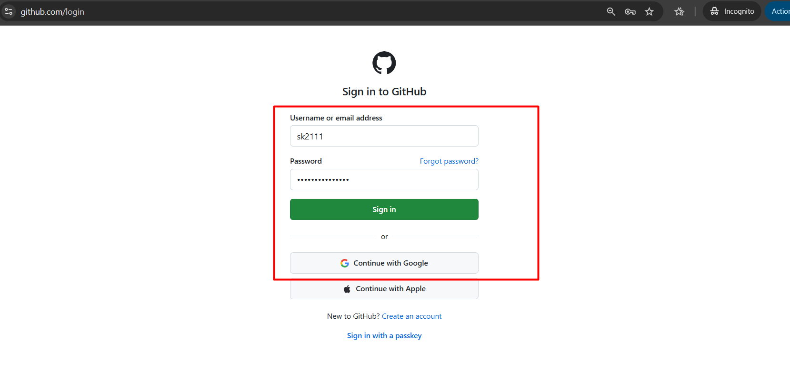
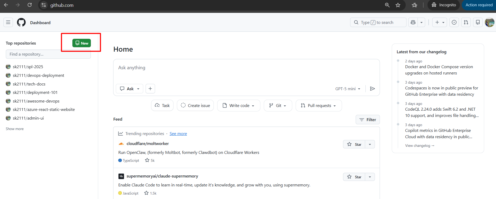
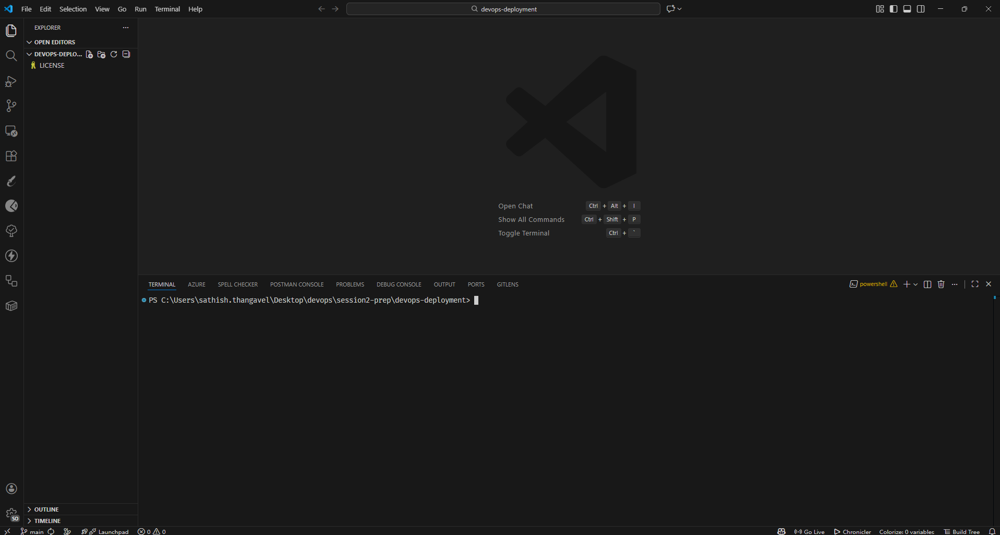
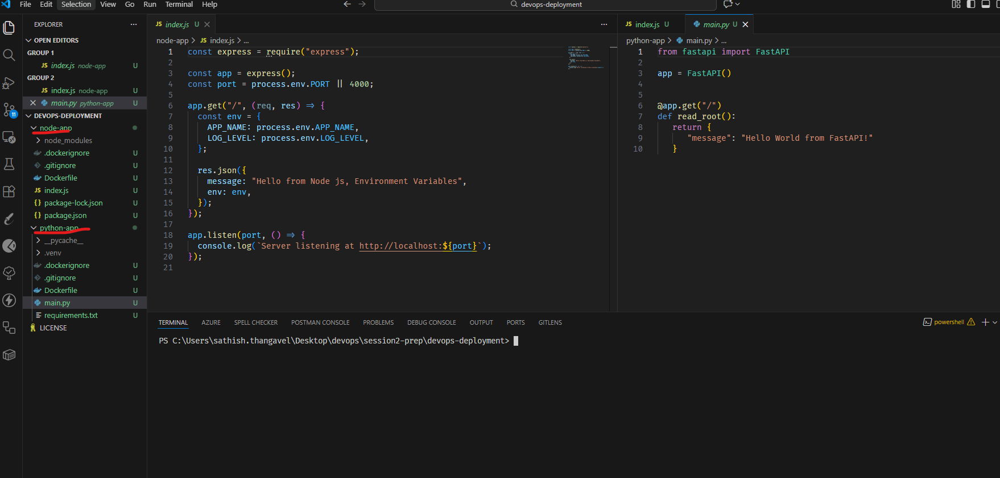
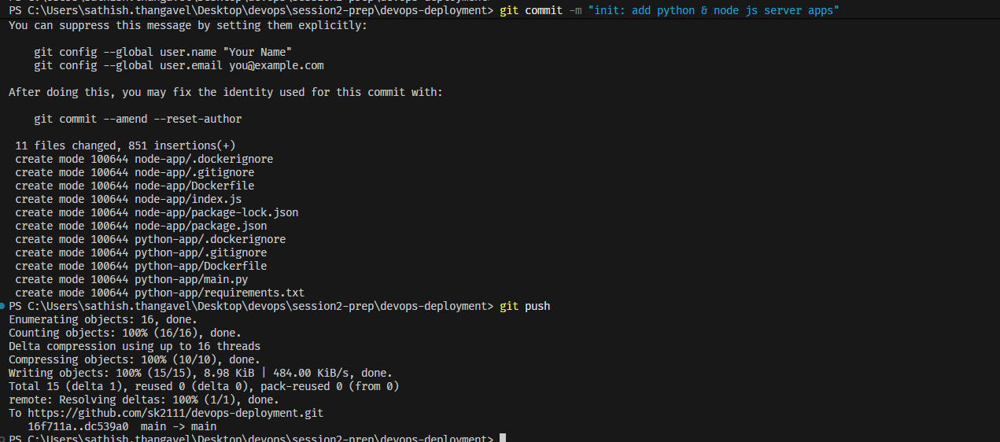

# Github Repo Setup

To create a new GitHub repository, follow these steps:

1. **Log in to GitHub**: Go to [GitHub](https://github.com) and sign in with
   your personal account.

   
   

2. **Create a New Repository**: Click the green "New" button on the left side
   of the page.
   
3. **Fill in Repository Details**:
   1. **Repository Name**: Enter a unique name for your repository.
   2. **Description**: Optionally, add a brief description of your project.
   3. **Set Repository visibility**:Choose between "Public" (anyone can see this
      repository) but its fine for this workshop
      

4. **Create Repository**: Click the green "Create repository" button at the bottom
   of the page to finalize the creation of your new repository.
   
5. **Clone the Repository**: After creating the repository, you can clone it to
   your local machine using the provided URL. Use the command:

   ```bash
    git clone <repository-url>
   ```

6. After cloning to your local machine, navigate into the repository folder &
   open in VS Code:

   ```bash
   cd <repository-name>
   code .
   ```

   
   

## Move the Python or Node app into the Repo

1. Now, let's move your existing Python or Node.js application files from
   workshop 1 into the newly cloned repository folder on your local machine.

   

   :::important
   If you don't have the apps in handy, you can download them from the link
   [Download the Python & Node Js Apps](https://github.com/sk2111/devops-deployment)
   :::

2. After moving the application files, you need to commit and push these changes
   to your GitHub repository. Use the following commands

   ```bash
    git add .
    git commit -m "init: add python & node js server apps"
    git push origin main
   ```

   
   

:::tip[production tip]

1. We **don't push directly** to `main branch` in production, we create feature branches,
   make changes there and create pull requests to merge into main branch after
   reviews.
2. In production, it's a good practice to create a `.gitignore` file in your
   repository to exclude files and directories that should not be tracked by Git.

:::
