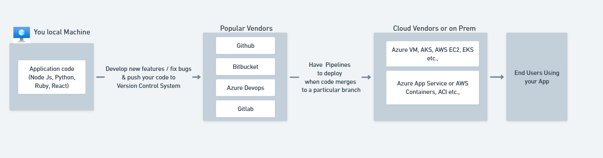
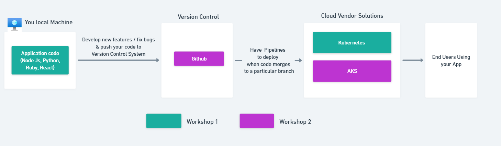

# Motivation

This workshop is designed around real-world project learnings that come from
hours of learning and solving practical DevOps problems. The goal is to give
you a solid understanding of why things work the way they
do in the DevOps world.

`If this workshop helps you gain skills that make your life easier or
supports your DevOps journey, then its purpose is achieved..`

:::important

1. DevOps has a steep learning curve, building expertise requires time & consistent
   practice.
2. This workshop aims to make you comfortable in DevOps Space so you can confidently
   learn/build on top of them.

:::

## How we deploy apps today?

## What we will do in this workshop ?

1. **Workshop 1** consists of following sections, focus is getting hands-on experience
   on

   1. Containerization
   2. Understanding foundation of Kubernetes
   3. Orchestration using Kubernetes in local machine

2. In **Workshop 2** we use the foundation from Workshop 1 to understand
   behind the scenes of Enterprise grade deployments.
   1. CD using GitHub Actions for multiple environments (Dev, QA, Prod)
   2. Deploying to Azure Kubernetes Service (AKS) & possibly OpenShift
